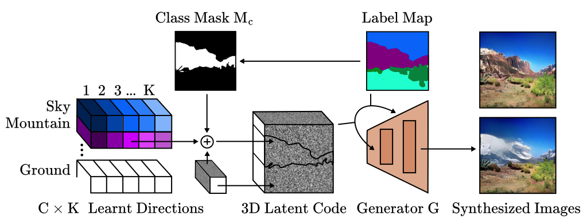

# Ctrl-SIS
Official code for the Paper "**Ctrl-SIS: Class-Specific GAN Controls for Semantic Image Synthesis**"

The paper can be found here: https://arxiv.org/abs/2212.01455.  Please cite the above paper when reporting, reproducing or extending the results.



## Commands
Create and load conda environment
```powershell
conda env create -f environment.yml
source activate ctrlsis
```

Train the model
```powershell
python train.py 
```


## License

This project is open-sourced under the AGPL-3.0 license. See the
[LICENSE](LICENSE) file for details.

For a list of other open source components included in this project, see the
file [3rd-party-licenses.txt](3rd-party-licenses.txt).

## Purpose of the project

This software is a research prototype, solely developed for and published as
part of the publication cited above. It will neither be
maintained nor monitored in any way.
